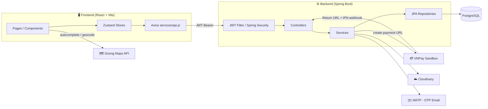

# 🛒 ShopVN — Full-Stack E-Commerce Platform

**React 19 · Spring Boot 3 · PostgreSQL · VNPay Sandbox · Cloudinary**

Nền tảng thương mại điện tử full-stack với đầy đủ vòng đời đơn hàng: giỏ hàng → thanh toán (VNPay/COD) → bảo hành → đổi trả, cùng bộ công cụ quản trị (dashboard, tồn kho, khuyến mãi) dành cho admin.

<p align="left">
  
  
  
  
  
  
  
  
  
</p>

---

## 📖 Mục lục

- [Tổng quan & Tính năng](#-tổng-quan--tính-năng)
- [Công nghệ sử dụng](#-công-nghệ-sử-dụng)
- [Kiến trúc hệ thống](#-kiến-trúc-hệ-thống)
- [Bắt đầu nhanh](#-bắt-đầu-nhanh-getting-started)
- [Cấu trúc thư mục](#-cấu-trúc-thư-mục)
- [API Overview](#-api-overview)
- [Luồng thanh toán VNPay](#-luồng-thanh-toán-vnpay)
- [Định hướng phát triển](#-định-hướng-phát-triển)
- [Tác giả](#-tác-giả--liên-hệ)

---

## ✨ Tổng quan & Tính năng

### 👤 Dành cho khách hàng

- 🔐 Đăng ký/đăng nhập với **xác thực OTP qua email**, JWT access + refresh token tự động làm mới
- 🛍️ Duyệt sản phẩm theo danh mục, biến thể (màu/size...), tìm kiếm có gợi ý (autocomplete)
- ⭐ Đánh giá sản phẩm kèm ảnh
- 🛒 Giỏ hàng, chọn item cần mua khi checkout (không bắt buộc thanh toán cả giỏ)
- 📍 Chọn địa chỉ giao hàng qua bản đồ (tích hợp Goong Maps — autocomplete, reverse geocoding)
- 🏷️ Áp mã giảm giá tại trang thanh toán
- 💳 Thanh toán **VNPay (sandbox)** hoặc **COD**
- 📦 Theo dõi đơn hàng, huỷ đơn (kèm lý do), retry thanh toán cho đơn chưa hoàn tất
- 🛠️ Yêu cầu **bảo hành** theo mã đơn/mã bảo hành, tra cứu trạng thái
- ↩️ Yêu cầu **hoàn/trả hàng** cho đơn đã giao
- 👤 Quản lý hồ sơ cá nhân, đổi mật khẩu (yêu cầu xác thực lại), upload avatar

### 🛠️ Dành cho quản trị viên (Admin)

- 📊 Dashboard thống kê tổng quan
- 📦 CRUD sản phẩm (đa ảnh, biến thể, thông số kỹ thuật) qua modal nhiều tab
- 🧾 Quản lý đơn hàng, cập nhật trạng thái
- 👥 Quản lý người dùng (khoá/mở tài khoản)
- 🏷️ Quản lý mã khuyến mãi/coupon
- 📥 Quản lý nhập/xuất **tồn kho**
- 🛡️ Xử lý yêu cầu **bảo hành**
- ↩️ Xử lý yêu cầu **đổi/trả hàng**
- ⚙️ Cài đặt hệ thống

---

## 🧰 Công nghệ sử dụng

### Backend

| Thành phần | Công nghệ |
| --- | --- |
| Framework | Spring Boot 3.2.4 (Java 17) |
| Bảo mật | Spring Security + JWT (`jjwt` 0.12.5) |
| ORM | Spring Data JPA / Hibernate |
| Database | **PostgreSQL** |
| Mapping DTO | MapStruct 1.5.5 |
| Boilerplate | Lombok |
| Upload ảnh | commons-io + **Cloudinary** (lưu trữ đám mây, không lưu local) |
| Email | Spring Mail + Thymeleaf (template HTML cho OTP) |
| Build | Maven |

### Frontend

| Thành phần | Công nghệ |
| --- | --- |
| UI Library | React 19 |
| Build tool | Vite 8 |
| Styling | Tailwind CSS 3.4 |
| State management | Zustand 5 (+ `persist` middleware cho auth) |
| Data fetching | Axios (interceptor tự gắn/refresh JWT) + TanStack React Query |
| Routing | React Router DOM 7 |
| Icons | Font Awesome Free, react-icons |
| Charts | Recharts (dashboard admin) |
| Thông báo | react-hot-toast |

### Dịch vụ bên thứ ba

- **VNPay Sandbox** — cổng thanh toán
- **Cloudinary** — lưu trữ & xử lý ảnh sản phẩm/avatar
- **Goong Maps** — autocomplete địa chỉ & reverse geocoding (dịch vụ bản đồ cho thị trường Việt Nam)

---

## 🏗️ Kiến trúc hệ thống



**Nguyên tắc kiến trúc:**

- Backend theo Layered Architecture: `Controller → Service → Repository → Entity`, tách DTO request/response, dùng MapStruct để mapping thay vì viết tay.
- Frontend tổ chức theo hướng feature-based: `pages/` (theo route), `components/` (theo domain: `admin`, `product`, `order`, `common`), `store/` (Zustand), `services/` (tầng gọi API tập trung duy nhất).
- **Xác thực**: JWT access token (ngắn hạn) + refresh token, tự động làm mới qua Axios response interceptor khi gặp `401`.
- **Thanh toán**: tách bạch rõ ràng giữa *Return URL* (chỉ hiển thị kết quả cho người dùng) và *IPN webhook* (server-to-server, nơi **duy nhất** cập nhật trạng thái đơn hàng) — đúng khuyến nghị bảo mật của VNPay.

---

## 🚀 Bắt đầu nhanh (Getting Started)

### Yêu cầu môi trường (Prerequisites)

- **Java** 17+
- **Maven** 3.9+
- **Node.js** 20+ và npm
- **PostgreSQL** 14+
- Tài khoản **VNPay Sandbox** ([đăng ký tại đây](https://sandbox.vnpayment.vn/devreg/))
- Tài khoản **Cloudinary** (free tier đủ dùng cho dev)
- API key **Goong Maps** ([goong.io](https://goong.io)) nếu muốn dùng tính năng chọn địa chỉ trên bản đồ

### 1️⃣ Database

```bash
createdb ecommerce
psql -U postgres -d ecommerce -f docs/schema.sql
```

### 2️⃣ Backend

Cấu hình `backend/src/main/resources/application.yml`:

```yaml
spring:
  datasource:
    url: jdbc:postgresql://localhost:5432/ecommerce
    username: postgres
    password: your_postgres_password

vnpay:
  tmn-code: YOUR_VNPAY_TMN_CODE
  hash-secret: YOUR_VNPAY_HASH_SECRET
  return-url: http://localhost:5173/payment/vnpay-return

cloudinary:
  cloud-name: YOUR_CLOUD_NAME
  api-key: YOUR_API_KEY
  api-secret: YOUR_API_SECRET

spring.mail:
  host: smtp.gmail.com
  username: your_email@gmail.com
  password: your_app_password
```

> ⚠️ **Không commit** file chứa secret thật (`application.yml` với giá trị thật, hoặc `.env`) lên Git. Dùng `application-local.yml` (gitignored) hoặc biến môi trường.

```bash
cd backend
mvn spring-boot:run
# API chạy tại http://localhost:8080/api
```

### 3️⃣ Frontend

Tạo file `.env` trong thư mục `frontend/`:

```bash
VITE_API_URL=http://localhost:8080/api
VITE_GOONG_MAPS_KEY=your_goong_maps_key
VITE_GOONG_API_KEY=your_goong_api_key
```

```bash
cd frontend
npm install
npm run dev
# Frontend chạy tại http://localhost:5173
```

### 4️⃣ Test thanh toán VNPay (cần expose localhost ra internet cho IPN)

```bash
ngrok http 8080
# Cập nhật Return URL / IPN URL trong dashboard VNPay Sandbox trỏ về URL ngrok
```

**Thẻ test VNPay Sandbox:**

| Trường | Giá trị |
| --- | --- |
| Ngân hàng | NCB |
| Số thẻ | `9704198526191432198` |
| Tên chủ thẻ | NGUYEN VAN A |
| Ngày phát hành | 07/15 |
| OTP | `123456` |

### 🔑 Tài khoản mặc định (seed data)

| Vai trò | Email | Mật khẩu |
| --- | --- | --- |
| ADMIN | <admin@ecommerce.vn> | Admin@123 |
| USER | <user@ecommerce.vn> | User@123 |

---

## 📁 Cấu trúc thư mục

```
ecommerce/
├── backend/
│   ├── pom.xml
│   └── src/main/
│       ├── java/com/ecommerce/
│       │   ├── config/          # SecurityConfig, AppConfig
│       │   ├── controller/      # Auth, Product, Cart, Order, Payment, Warranty, Return, Coupon, Inventory, Admin
│       │   ├── dto/             # request/ + response/
│       │   ├── entity/          # User, Product, Variant, Category, Cart, Order, Payment, Warranty, Return, Coupon...
│       │   ├── enums/           # Role, OrderStatus, PaymentStatus, PaymentGateway
│       │   ├── exception/       # GlobalExceptionHandler
│       │   ├── payment/vnpay/   # VNPayConfig, VNPayService  ← CORE
│       │   ├── repository/
│       │   ├── security/        # JwtService, JwtAuthenticationFilter
│       │   └── service/impl/
│       └── resources/application.yml
│
├── frontend/
│   └── src/
│       ├── components/
│       │   ├── admin/           # AdminLayout, product/ (BasicInfoTab, VariantsTab, ImagesTab, SpecsTab...)
│       │   ├── common/          # Navbar, Footer, AddressPickerModal, ReviewModal, WarrantyModal, ReturnModal...
│       │   ├── order/           # OrderProgress, OrderItems, OrderCancelModal, OrderRetryPayment...
│       │   └── product/         # ProductCard, ProductImages, ProductReviews, Lightbox...
│       ├── hooks/                # useProductVariant
│       ├── pages/                # HomePage, ProductsPage, CheckoutPage, VNPayReturnPage, WarrantyPage...
│       │   └── admin/            # DashboardPage, ProductsAdminPage, InventoryAdminPage, ReturnsAdminPage...
│       ├── services/api.js       # Axios instance + tất cả API modules
│       └── store/                # authStore.js, cartStore.js (Zustand)
│
└── docs/
    └── schema.sql
```

---

## 📡 API Overview

### Auth

```
POST /api/auth/send-otp
POST /api/auth/verify-otp
POST /api/auth/register
POST /api/auth/login
POST /api/auth/refresh
```

### Sản phẩm & Danh mục

```
GET    /api/products?page=0&size=12&keyword=...&categoryId=1
GET    /api/products/{id}
GET    /api/products/slug/{slug}
POST   /api/products                          (admin, multipart)
POST   /api/products/{id}/variants            (admin)
GET    /api/search/suggestions
GET    /api/search?q=...
```

### Giỏ hàng & Đơn hàng

```
GET    /api/cart
POST   /api/cart/items
POST   /api/orders                            (tạo đơn từ các cartItemId đã chọn)
PUT    /api/orders/{id}/cancel?reason=...
GET    /api/orders/admin/all?status=PAID       (admin)
```

### Thanh toán

```
POST /api/payment/create-payment   { orderId } → { paymentUrl }
GET  /api/payment/vnpay-return     (redirect người dùng)
GET  /api/payment/vnpay-ipn        (webhook server-to-server, cập nhật trạng thái)
```

### Hậu mãi

```
POST /api/warranty
GET  /api/warranty/lookup/{code}
POST /api/returns
GET  /api/coupons/apply?code=...&orderTotal=...
GET  /api/inventory?productId=...
```

### Admin

```
GET /api/admin/dashboard
GET /api/admin/users
PUT /api/admin/users/{id}/toggle-status
```

---

## 💳 Luồng thanh toán VNPay

```
1. Người dùng nhấn "Thanh toán qua VNPay"
   └─ CheckoutPage → POST /orders (tạo đơn, trừ tồn kho, backend tự tính lại tổng tiền)

2. Frontend nhận orderId → POST /payment/create-payment
   └─ Backend: build tham số → ký HMAC-SHA512 → lưu Payment (PENDING) → trả về paymentUrl

3. Frontend redirect sang VNPay Sandbox, người dùng nhập thẻ test

4. VNPay thực hiện song song 2 việc:
   a) REDIRECT người dùng → GET /payment/vnpay-return  → hiển thị kết quả
   b) IPN WEBHOOK (server-to-server) → GET /payment/vnpay-ipn
      └─ Verify chữ ký HMAC-SHA512 → kiểm tra số tiền → idempotency check
         → cập nhật Order.status = PAID, Payment.status = SUCCESS
```

> ⚠️ **Quan trọng**: chỉ cập nhật trạng thái đơn hàng tại **IPN webhook**, không tại Return URL — vì Return URL có thể bị giả mạo bởi người dùng, còn IPN là kết nối server-to-server an toàn hơn.

### Mã phản hồi VNPay thường gặp

| Code | Ý nghĩa |
| --- | --- |
| `00` | ✅ Giao dịch thành công |
| `24` | ❌ Khách hàng huỷ giao dịch |
| `51` | Tài khoản không đủ số dư |
| `65` | Vượt hạn mức giao dịch trong ngày |
| `75` | Ngân hàng đang bảo trì |

---

## 🗺️ Định hướng phát triển

- [ ] Docker hoá toàn bộ (backend + frontend + Postgres + Redis) qua `docker-compose.yml`
- [ ] CI/CD với GitHub Actions (build, test, lint tự động)
- [ ] Viết Unit/Integration test (JUnit + Mockito cho backend, Vitest + RTL cho frontend) — ưu tiên luồng thanh toán & giỏ hàng
- [ ] Redis caching cho danh mục, sản phẩm nổi bật, kết quả tìm kiếm
- [ ] Chuyển sang lưu access token trong bộ nhớ + refresh token trong cookie `httpOnly`
- [ ] Thêm React Error Boundary cho toàn app
- [ ] Chuẩn hoá form validation với `react-hook-form` + `zod`
- [ ] Message Queue (RabbitMQ) cho xử lý bất đồng bộ IPN/email
- [ ] Recommendation engine (gợi ý sản phẩm liên quan/cùng danh mục trước, ML sau)

---

## 👤 Tác giả & Liên hệ

**Tên của bạn**
📧 <your.email@example.com> · 🔗 [GitHub](https://github.com/your-username) · 💼 [LinkedIn](https://linkedin.com/in/your-profile)

---

<p align="center">⭐ Nếu dự án hữu ích, hãy để lại một star trên GitHub!</p>
